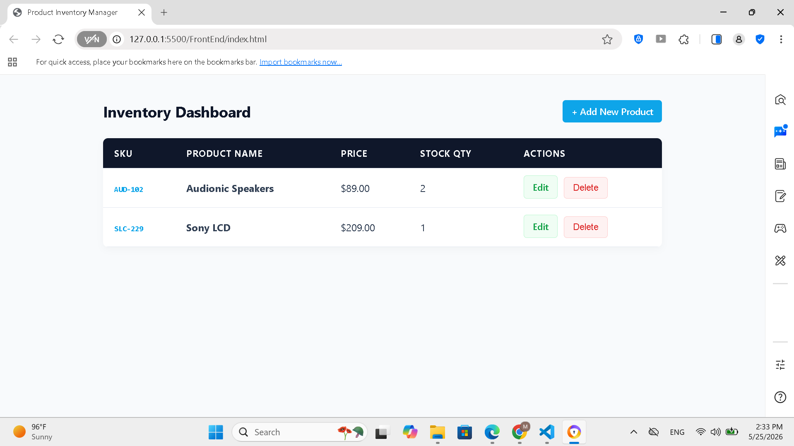
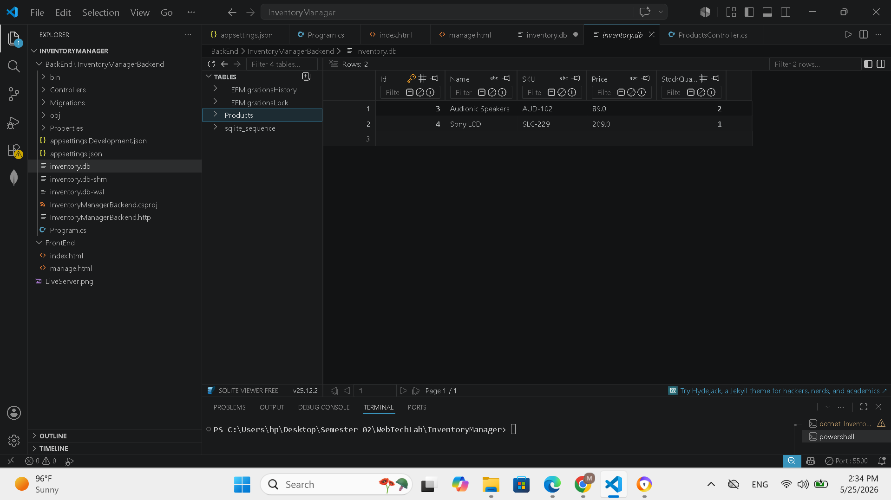
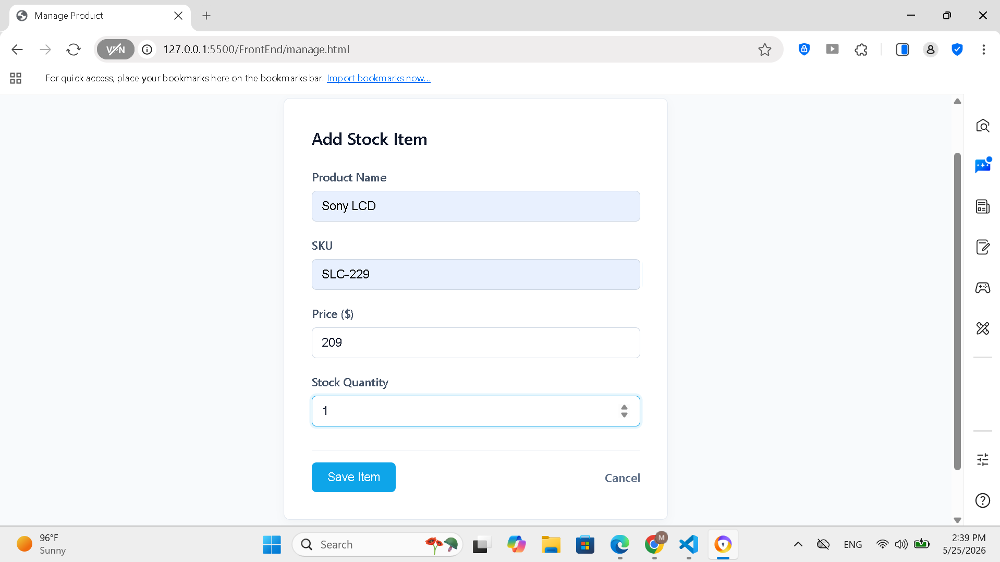

# Product Inventory Manager (Full-Stack Web Application)

A modern, full-stack inventory management system built to fulfill the Web Technologies Database Connectivity Assignment. The application features a minimalist, dark slate and teal administrative dashboard connected directly to a local transactional SQLite database engine via Entity Framework Core (ORM), facilitating complete CRUD operations with active client-side form validation controls.

## 🚀 Key Features Implemented
* **Dynamic Stock Tracking (GET):** Real-time data parsing directly from the local database onto a customized dashboard table view.
* **Inventory Entry Creation (POST):** Form processing with defensive client-side field validation to block null values.
* **Stock Context Amendment (PUT):** State-preserving editing views leveraging URL parameters.
* **Document Erasure (DELETE):** Instant record removal equipped with security safety confirmation modals.

## 🛠️ Technology Stack
* **Frontend:** Semantic HTML5, Custom CSS3 (Slate & Teal Theme), Vanilla JavaScript (ES6+ Fetch API).
* **Backend Framework:** ASP.NET Core Web API (C#).
* **Database Management:** SQLite Database Engine integrated via Entity Framework Core.

---

## 💻 Local Environment Setup Instructions

Follow these step-by-step instructions to initialize and host the application environment locally:

### 1. Backend Web API Launch
1. Open your system terminal and navigate to the backend repository root folder:
   ```bash
   cd BackEnd/InventoryManagerBackend
   ```
2. Restore missing framework dependency packages:
   ```bash
   dotnet restore
   ```
3. Run the following command to apply the relational schema design and migrations directly onto your local database file:
   ```bash
   dotnet ef database update
   ```
4. Boot up the live C# compilation hosting environment:
   ```bash
   dotnet run
   ```
*Note: Ensure the terminal console port mapping string matches the `const API` variable configured in your frontend scripts.*

### 2. Frontend Execution
1. Navigate into the `FrontEnd` folder directory.
2. Launch `index.html` using a local static hosting extension (such as VS Code Live Server hosting on `http://127.0.0.1:5277`) or open it directly within any modern web browser wrapper.

---

## 📊 Live Application Preview

### Management System Dashboard Layout


## 📊 DataBase Preview

### SQL DataBase Preview


## 📊 Live Product Addition Preview

### Manage Page

